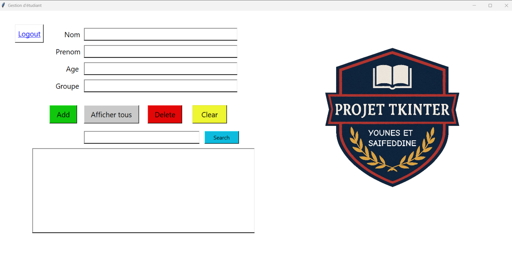

# Gestion Étudiants avec Tkinter

Ce projet est une application simple en Python utilisant Tkinter pour gérer une liste d’étudiants.

Description
L’application démarre avec une fenêtre de connexion.
Pour se connecter, il faut utiliser les identifiants suivants :

Nom d’utilisateur : admin

Mot de passe : 0000

Une fois connecté, l’utilisateur est redirigé vers une autre fenêtre qui offre plusieurs fonctionnalités :

Ajouter un étudiant

Supprimer un étudiant

Afficher tous les étudiants

Rechercher un étudiant par nom et prénom

Effacer les champs de saisie pour une nouvelle entrée

Les données des étudiants sont sauvegardées dans un fichier CSV, ce qui permet une gestion simple et efficace des informations.
